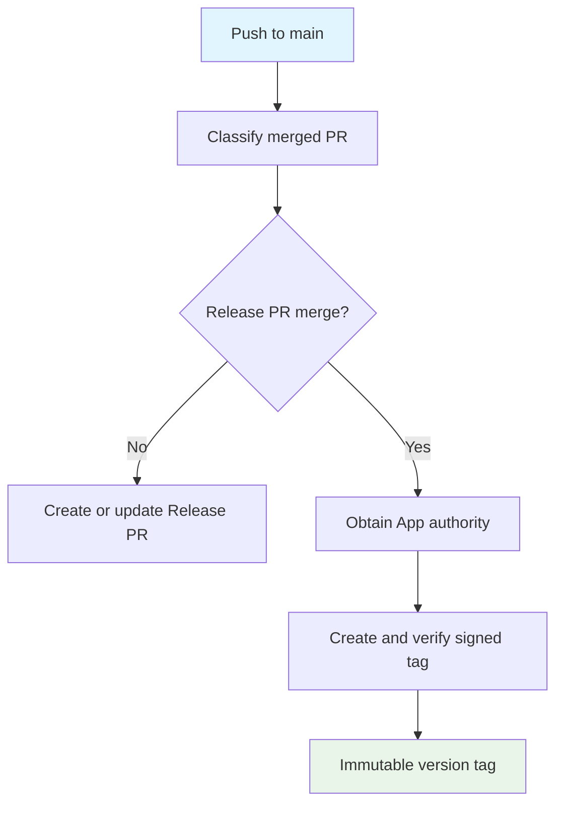

## Workflow Overview

**Purpose**: Keep the pending Release PR current after ordinary `main` changes, then create the immutable signed version tag when that Release PR merges.
**Trigger Events**: Pushes to `main`.
**Target Environments**: `release-signing` only for tag creation.

## Execution Flow Diagram

## Jobs & Dependencies

| Job | Purpose | Dependencies | Execution context |
|---|---|---|---|
| Classify merge | Determine whether the pushed commit merged a release-plz Release PR. | Trigger | Hosted Linux runner |
| Release PR | Reconcile the version-and-changelog PR for versionable changes. | Classification: ordinary merge | Hosted Linux runner, GitHub App authority |
| Signed tag | Create and locally verify the next annotated version tag. | Classification: Release PR merge | Hosted Linux runner, `release-signing` environment, GitHub App authority |

## Requirements Matrix

### Functional Requirements

| ID | Requirement | Priority | Acceptance criteria |
|---|---|---|---|
| REQ-001 | Ordinary merges reconcile one Release PR. | High | The pending PR contains the next version and generated changelog. |
| REQ-002 | A merged Release PR creates exactly one matching version tag. | High | A new annotated `vX.Y.Z` tag points to the merge commit. |
| REQ-003 | Non-release merges never create a tag. | High | They only enter the Release PR reconciliation path. |
| REQ-004 | Existing tags are never replaced. | High | A duplicate tag stops the run without pushing a ref. |

### Security Requirements

| ID | Requirement | Implementation constraint |
|---|---|---|
| SEC-001 | Release PR and tag writes use the release App identity. | The workflow token is not used for repository writes. The classifier requires the merged PR to originate in this repository and be authored by `runrly-echo[bot]`. |
| SEC-002 | The private signing key is isolated. | Only the signed-tag job accesses `release-signing`. |
| SEC-003 | Tags are attributable and verifiable. | The tag is annotated, SSH-signed, and verified before push. |
| SEC-004 | Release tags are immutable. | The repository ruleset permits creation only by the release App and blocks updates/deletions. |

## Input/Output Contracts

### Inputs

| Type | Name | Purpose | Scope |
|---|---|---|---|
| Trigger | `main` push | Supplies the candidate merged commit. | Repository |
| Configuration | Release-plz configuration | Defines versioning and changelog policy. | Repository |
| Secret | `RUNRLY_ECHO_APP_ID` and private key | Grants release App authority. | Repository |
| Secret | `RUNRLY_ECHO_SIGNING_PRIVATE_KEY` | Signs the release tag as `runrly-echo <echo@runrly.dev>`. | `release-signing` |

### Outputs

| Output | Description |
|---|---|
| Release PR | A single open PR containing a version bump and changelog when versionable changes exist. |
| Signed tag | An immutable annotated tag whose version matches the Cargo package. |

## Execution Constraints

- Hosted Linux runners must provide Git, Cargo metadata support, SSH signing support, and GitHub API access.
- The release App requires repository write authority; the classifier requires read-only pull-request metadata.
- A Release PR is trusted only when it is merged into the current base branch, originates in this repository, uses the reserved `release-plz-` prefix, and is authored by `runrly-echo[bot]`.
- A valid public signing key must be registered with the maintainer GitHub account before the first tag.
- Main-push executions are queued rather than cancelled, so a merged Release PR is never superseded by a later push.

## Error Handling Strategy

| Error | Response | Recovery |
|---|---|---|
| No versionable changes | Finish without a Release PR update. | Merge future versionable changes normally. |
| Missing signing secret | Fail before tag creation. | Configure `release-signing`; rerun after correcting it. |
| Existing tag | Fail without mutating refs. | Investigate the prior release; never force-push. |
| Invalid signature | Fail before push. | Rotate/correct the signing key and rerun. |

## Quality Gates

| Gate | Criteria | Bypass conditions |
|---|---|---|
| Release PR merge | Main branch protection and required review/checks pass. | Repository policy only. |
| Tag signing | Environment branch policy permits the run. | None. |
| Tag ruleset | Only the release App creates a `v*` ref. | Release App only. |

## Change Management

1. Update this specification and the release ADR when the contract changes.
2. Review workflow, ruleset, environment, and secret-scope effects together.
3. Validate workflow syntax and a representative Release PR path.
4. Preserve tag immutability and the separation between signing and publication.
5. Keep signing behavior in its dedicated script; do not duplicate it in workflow YAML.

## Related Specifications

- [Manual Release Publication](spec-process-cicd-release-publication.md)
- [ADR-0007](../adr/adr-0007-use-signed-tags-and-approved-manual-releases.md)

## Version History

| Version | Date | Changes |
|---|---|---|
| 1.4 | 2026-07-18 | Required same-repository Runrly Echo bot authorship before signing a tag. |
| 1.3 | 2026-07-18 | Renamed the signing environment to release-signing. |
| 1.2 | 2026-07-18 | Defined the Runrly Echo tagger identity and signing secret. |
| 1.1 | 2026-07-18 | Added queued execution and dedicated signing responsibility. |
| 1.0 | 2026-07-18 | Initial specification. |
