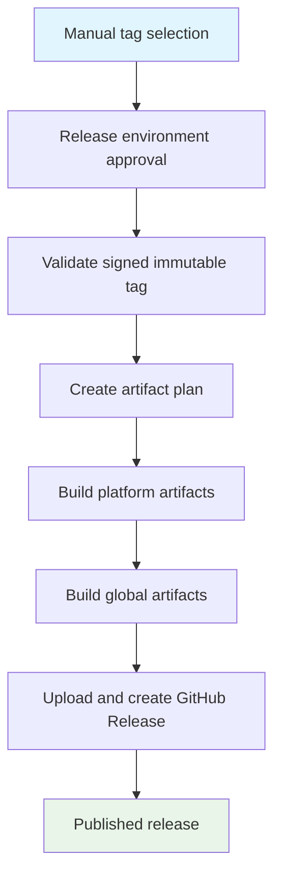

## Workflow Overview

**Purpose**: Build and publish release artifacts only for a pre-existing, verified signed tag after a maintainer approves publication.
**Trigger Events**: Manual dispatch with a release tag; pull requests run the artifact plan only.
**Target Environments**: `release-publication` for manual publication approval.

## Execution Flow Diagram

## Jobs & Dependencies

| Job | Purpose | Dependencies | Execution context |
|---|---|---|---|
| Release gate | Approve and validate the requested tag, commit, signature, ancestry, and package version. | Manual trigger | Hosted Linux runner, `release-publication` environment |
| Plan | Determine required artifact work; on pull requests, validate only the plan. | Gate for publication | Hosted Linux runner |
| Local artifacts | Build and attest platform-specific archives/installers. | Plan | Matrix-selected runners/containers |
| Global artifacts | Produce checksums and cross-platform outputs. | Plan, local artifacts | Hosted Linux runner |
| Host | Upload artifacts and create the GitHub Release. | Plan and builds | Hosted Linux runner with release-write authority |

## Requirements Matrix

### Functional Requirements

| ID | Requirement | Priority | Acceptance criteria |
|---|---|---|---|
| REQ-001 | Publication accepts an explicit existing tag. | High | A dispatch without a valid SemVer tag fails. |
| REQ-002 | The tag must be signed, annotated, verified, on `main`, and version-aligned. | High | Each condition is validated before planning/building. |
| REQ-003 | Pull requests validate the distribution plan without publishing. | High | No GitHub Release or release asset is created. |
| REQ-004 | Publication builds all configured targets and attaches generated assets. | High | The GitHub Release contains cargo-dist outputs and attestations. |

### Security Requirements

| ID | Requirement | Implementation constraint |
|---|---|
| SEC-001 | A maintainer approves before resource-intensive work starts. | The validation job targets the protected `release-publication` environment. |
| SEC-002 | Publication cannot substitute a branch tip for the chosen tag. | Every build checks out the validated tag ref. |
| SEC-003 | Only the final publication job can write release content. | Other jobs use read-only or attestation-scoped permissions. |
| SEC-004 | Signing material is unavailable to publication. | The workflow never targets `release-signing`. |

## Input/Output Contracts

### Inputs

| Type | Name | Purpose | Scope |
|---|---|---|---|
| Dispatch input | `tag` | Existing candidate release tag. | Manual trigger |
| Repository state | `main` and tag refs | Establishes ancestry and target commit. | Repository |
| Artifact configuration | Cargo-dist configuration | Defines target matrix, installers, checksums, and attestations. | Repository |

### Outputs

| Output | Description |
|---|---|
| Validated release context | Immutable tag and commit used by every build job. |
| Build artifacts | Platform archives, installers, checksums, and attestations. |
| GitHub Release | Published release targeting the validated commit. |

## Execution Constraints

- Publication dispatches for the same tag are queued; a second run never overlaps the first.
- Runners require network access for tool installation, dependencies, artifact storage, and release upload.
- The release approval must be granted before any distribution planning or building for a manual dispatch.

## Error Handling Strategy

| Error | Response | Recovery |
|---|---|---|
| Invalid/missing tag | Stop before build. | Dispatch with an existing semantic version tag. |
| Unverified or lightweight tag | Stop before build. | Investigate the signing workflow; do not recreate the ref. |
| Tag/version mismatch | Stop before build. | Correct through a new Release PR and tag. |
| Artifact build failure | Do not publish a release. | Fix the source/configuration and rerun for the same validated tag if no release exists. |
| Release upload failure | Preserve logs and artifacts where available. | Correct credentials/service issue and rerun deliberately. |

## Quality Gates

| Gate | Criteria | Bypass conditions |
|---|---|---|
| Approval | Maintainer approves the protected `release-publication` environment. | None. |
| Tag validation | SemVer shape, annotation, GitHub verification, `main` ancestry, and package-version match. | None. |
| Artifact plan | Cargo-dist produces a valid distribution plan. | Pull requests never publish. |
| Publication | All required build jobs succeed. | None. |

## Monitoring & Observability

- Use workflow run logs for approval, validation, plan, build, attestation, and upload outcomes.
- Use the generated release and artifact attestations as durable publication evidence.
- Review manual dispatch history to audit who approved and published each version.

## Change Management

1. Update this specification and ADR-0007 first.
2. Regenerate or compare the cargo-dist section when upgrading cargo-dist.
3. Preserve the explicit tag validation and approval gate.
4. Validate pull-request planning and a non-production manual dispatch path before relying on a workflow change.
5. Keep tag validation in its dedicated script; do not duplicate it in workflow YAML.

## Related Specifications

- [Release PR and Signed Tag](spec-process-cicd-release-pr.md)
- [ADR-0007](../adr/adr-0007-use-signed-tags-and-approved-manual-releases.md)

## Version History

| Version | Date | Changes |
|---|---|---|
| 1.2 | 2026-07-18 | Renamed the approval environment to release-publication. |
| 1.1 | 2026-07-18 | Added per-tag queued publication and dedicated validation responsibility. |
| 1.0 | 2026-07-18 | Initial specification. |
